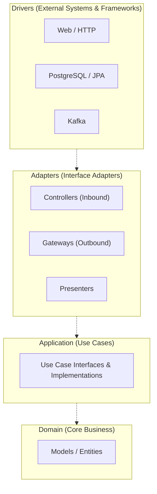

# Architecture

This project follows **Clean Architecture** (or Hexagonal Architecture / Ports and Adapters) principles to ensure the business logic remains isolated, testable, and independent of external frameworks, databases, or UI.

## Overview

The core philosophy of this architecture is the **Dependency Rule**: source code dependencies must point only inward, toward higher-level policies (domain/business logic).

### Mermaid: Layered Architecture

## Package Structure

The package structure is organized as follows:

- **`domain`**: Contains the core business models (e.g., `Order`, `Event`). It has no dependencies on the outside layers.
- **`application`**: Contains the use cases (e.g., `CreateOrderUseCase`, `ReserveStockUseCase`). These orchestrate the flow of data to and from the entities, and direct those entities to use their critical business rules to achieve the goals of the use case.
- **`adapters`**: Bridges the gap between the application and the external world.
  - `controllers`: REST APIs that handle HTTP requests and convert them into use case inputs.
  - `gateway`: Implementations of the output ports (interfaces defined in the application layer). For example, a `DatabaseOrderRepository` that implements an `OrderRepository` interface.
  - `presenters`: Formats the data returned from use cases into DTOs suitable for HTTP responses.
- **`drivers`**: The outermost layer containing framework-specific code.
  - `db`: Spring Data JPA repositories, entity classes, and configurations.
  - `messaging`: Kafka consumer and producer configurations.
  - `web`: Spring Web configurations, security, exception handling, etc.

## Benefits for this Project

1. **Testability**: Because the `domain` and `application` layers have no dependencies on Spring or a database, they can be tested using fast, reliable unit tests (without spinning up the application context).
2. **Maintainability**: Changes in the database schema or the messaging broker (e.g., swapping Kafka for RabbitMQ) only require changes in the `drivers` and `adapters` layers. The core logic remains untouched.
3. **Understandability**: The intent of the application is clear by looking at the `application` layer (the "Use Cases").
