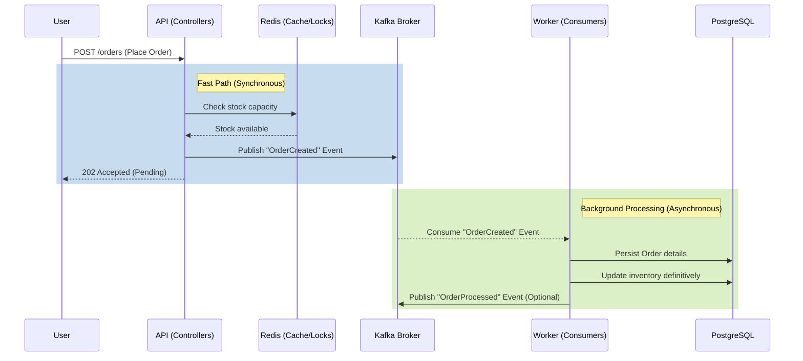

# Scalability

In a flash sale scenario, the system receives a massive number of requests in a very short window of time. Traditional monolithic synchronous approaches typically fail under such load due to thread exhaustion, database connection pool limits, or table locks.

This project implements several patterns to guarantee high availability and low latency during peak traffic.

## Main Business Flow: The Flash Sale Order

To achieve high throughput, the system decouples the **acceptance** of an order from the **processing** of an order.

### Mermaid: Order Flow



### Components

1. **Redis**: Used as a high-speed data store. It can be used to hold the available inventory in memory and decrement it atomically using Lua scripts or Redis native atomic operations. This prevents the database from becoming a bottleneck during the initial onslaught of requests.
2. **Kafka**: Acts as a buffer and an event streamer. Instead of waiting for the database transaction to commit, the API simply drops the order intent into a Kafka topic. This allows the API to return a success response to the user almost instantly.
3. **PostgreSQL**: Handles the final persistence of data. By moving this out of the critical synchronous path, we protect the database from being overwhelmed. Workers consume from Kafka at a pace the database can handle.

## Load Testing

To validate the scalability of the system, a stress test script is provided using **K6**.

The test is located at `src/test/java/com/self/study/flashsale/k6/stressTestk6.js`.

### What the test does:
The K6 script simulates a realistic flash sale traffic spike by ramping up Virtual Users (VUs):
- Ramps up to 100 VUs in 10s.
- Scales to 1,000 VUs in 30s.
- Hits **peak stress at 2,000 VUs** for 1 minute.
- Ramps down gracefully.

It tracks metrics via custom counters (`successful_requests` and `rejected_requests`) to measure the system's acceptance rate under peak load.

To run the test locally:
```bash
k6 run src/test/java/com/self/study/flashsale/k6/stressTestk6.js
```
